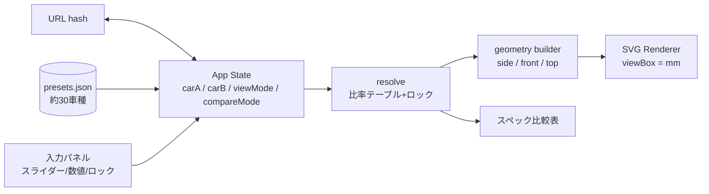
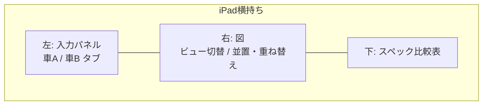

# Car Silhouette Configurator — 実装プラン

> このドキュメントは合意済みの要件・設計判断・タスク一覧の保存版。
> 開発を再開するときは「進捗」セクションを最初に読むこと。

## 進捗（2026-09-23 時点）

**Task 1〜5 完了。次は Task 6（正面図・上面図とビュー切替）。**

- 公開 URL: https://lyuin.github.io/car-configurator/
- リポジトリ: https://github.com/lyuin/car-configurator （public）

Task 1 で作ったもの:
- `package.json` と依存（バージョンは `--save-exact` で固定）
- `vite.config.ts`（Pages サブパス対応 + Vitest 設定）
- `tsconfig.json` / `tsconfig.app.json` / `tsconfig.node.json`（strict 系フル有効）
- `index.html`（iPad 向け viewport: `viewport-fit=cover`、ユーザースケール許可）
- `src/main.tsx` / `src/App.tsx` / `src/index.css`（プレースホルダ、セーフエリア対応）
- `src/vite-env.d.ts`（TypeScript 7 が CSS の副作用インポートに型宣言を要求するため必要）
- `src/__tests__/smoke.test.tsx`（React + TSX + Vitest の配線検証）
- `.github/workflows/deploy.yml`（main push → `npm ci` → `npm test` → `npm run build` → Pages）
- `README.md` / `.gitignore`

検証済み:
- `npm test` / `npm run build` が通る
- Pages は Actions ソースで有効化（`gh api -X POST repos/lyuin/car-configurator/pages -f build_type=workflow`）
- 公開 URL が HTTP 200、`base` が `/car-configurator/` に切り替わり JS / CSS も 200 で解決

インストール済みバージョン:

| パッケージ | バージョン |
|---|---|
| react / react-dom | 19.3.0 |
| vite | 8.3.0 |
| vitest | 5.0.1 |
| typescript | 7.0.2 |
| @vitejs/plugin-react | 6.1.1 |
| jsdom | 29.1.1 |

TypeScript は 7 系。`tsc -b` は問題なく動作した。ただし CSS の副作用インポートには
`src/vite-env.d.ts` の `/// <reference types="vite/client" />` が必須（無いと TS2882）。

## Problem Statement

車の主要寸法を数値で指定すると、簡易な線画（丸＋箱レベル、形状がわかる程度）で車を描画する Web アプリ。
iPad から使い、GitHub Pages で静的配信。状態は URL に保存でき、2台を見た目とスペックの両方で比較できる。

## 確定した要件

| # | 決定事項 |
|---|---|
| 0 | シルエットは 軽/ハッチ/セダン/ワゴン/クーペ/スポーツ/SUV/ミニバン/ピックアップ の9種（Task 4 で van を削除し sports を追加） |
| 1 | ビューは側面図・正面図・上面図の3種 |
| 2 | 既存車種はリポジトリ内蔵のプリセット JSON（外部 API 不使用） |
| 3 | Vite + TypeScript + React、GitHub Actions で Pages へデプロイ |
| 4 | 比較は「並置」と「オーバーレイ」をトグル切替 |
| 5 | タイヤは `225/55R18` 形式の規格表記をパースして外径算出 |
| 6 | 自動補完はシルエット別の典型比率テーブル + ロック/再計算 |
| 7 | グリッド + 寸法線トグル |
| 8 | プリセットは国内外問わず、寸法が似通っていない車を約30台 |
| 9 | スライダー + 数値、iPad 横持ち2カラム。図の直接ドラッグは後続 |
| 10 | 比較スペックは寸法系のみ |

## 将来の拡張（合意済み・今回は作らない）

- プリセット車種を基準にした差分補完（「CX-5 の比率を保ったまま全長だけ +200mm」）
- 人物シルエットによるスケール参照（身長可変、既定 170cm）
- 図のドラッグハンドルによる直接操作（ドラッグで寸法変更 + 自動ロック）
- 駆動レイアウト（FF / FR / MR / RR / 4WD Front・Rear）の選択
- パワートレイン搭載位置のドラッグと重量配分の算出・可視化

## 技術判断

**SVG で描画する（Canvas ではない）**
- 寸法線や数値ラベルを DOM として置ける
- `viewBox` を mm 単位にすれば2台を同一スケールで並べる処理がほぼ不要
- オーバーレイの半透明が素直
- 後からドラッグハンドルを足すときにヒットテストを自前実装せずに済む

`viewBox` は mm でとる。比較時は2台の外接矩形の和を `viewBox` にすることでスケール合わせが自動的に成立する。

**タイヤ外径の算出**

```
外径 = ホイール径(inch) × 25.4 + 2 × (タイヤ幅 × 扁平率 / 100)
```

ホイール径も別途保持し、リムとタイヤを描き分ける。

**自動補完**

純関数 `resolve(explicit, locks) → ResolvedSpec` に閉じ込める。
補完元を「シルエット平均比率」から「特定車種の比率」に差し替えるだけで差分補完へ拡張できる形にする。

**URL 形式**

`#` 以降に、明示指定（= ロック済み）の項目だけを短縮キーの key-value で載せる。
推定値は載せないので URL が短く、後で比率テーブルを改善したとき既存 URL も新しい推定に追従する。
先頭にスキーマ版 `s1` を置いて将来の形式変更に備える。

```
#s1&m=ov&v=side&a=sil:suv,L:4600,W:1845,H:1690,t:225/55R19&b=sil:wgn,L:4755,...
```

## アーキテクチャ



画面レイアウト（iPad 横持ち）:



## データモデル方針

```ts
type Silhouette = 'sedan' | 'hatch' | 'suv' | 'wagon' | 'minivan' | 'coupe' | 'kei' | 'pickup' | 'van';

// ユーザーが明示した値のみ（未指定は undefined = 推定対象）
interface CarInput {
  name?: string;
  silhouette: Silhouette;
  length?: number; width?: number; height?: number;
  wheelbase?: number;
  frontOverhang?: number; rearOverhang?: number;
  trackFront?: number; trackRear?: number;
  groundClearance?: number;
  tire?: string;        // '225/55R19'
  doors?: number;
}

// 全項目が埋まった状態 + 各項目の出所
interface ResolvedSpec extends Required<Omit<CarInput, 'name'>> {
  tireDiameter: number; rimDiameter: number; tireWidth: number;
  source: Record<keyof CarInput, 'explicit' | 'derived' | 'preset'>;
}
```

整合性の制約（`全長 = フロントOH + WB + リアOH`）は「ロックされていない項目を優先して吸収する」ルールで解決する。
全長・WB・OH がすべてロックされて矛盾した場合は警告を出し、リア OH で吸収する。

## タスク一覧

### Task 1: プロジェクト基盤と GitHub Pages への自動デプロイ ✅ 完了
- Vite + React + TypeScript 初期化、Vitest 導入、ダミーテスト1本
- `vite.config.ts` の `base` をリポジトリ名に（Pages サブパス対応）
- GitHub Actions で main push 時に build → Pages デプロイ
- iPad 向け `viewport` メタタグ（`viewport-fit=cover`、ユーザースケール許可）
- Demo: 公開 Pages URL を iPad Safari で開き、プレースホルダ画面が表示される

### Task 2: ドメイン型とタイヤ規格パーサ ✅ 完了

実装: `src/domain/types.ts`（`Silhouette` / `CarInput` / `ResolvedSpec` / `TireSpec` / `ParseResult`）、
`src/domain/tire.ts`（`parseTireSpec` / `tireOuterDiameter` / `formatTireSpec`）、テスト31件。

決めたこと:
- エラーは例外ではなく `ParseResult<T> = {ok:true,value} | {ok:false,error}` で返す。テキスト入力中の不正な文字列を「異常」ではなく「まだ有効でない状態」として UI に出したいため
- 入力は `String.normalize('NFKC')` してから解析。iPad の日本語キーボードの全角 `２２５／５５Ｒ１８` を救う
- `P` / `LT` プレフィックス、`ZR`、末尾のロードインデックス（`95V XL`）、リム径 0.5 刻みを受け付ける
- 受付範囲: タイヤ幅 100〜400mm / 扁平率 15〜95% / リム径 10〜30inch

<details>
<summary>当初のタスク定義</summary>
- `CarInput` / `ResolvedSpec` / `Silhouette` の型定義
- `parseTireSpec('225/55R18')` → 幅・扁平率・リム径・外径 を返す純関数
- テスト: 正常系（複数サイズの外径）、異常系（不正文字列、範囲外扁平率）、大文字小文字・スペースの揺れ
- Demo: `npm test` が全通し、任意サイズの外径が算出できる
</details>

### Task 3: 自動補完エンジン ✅ 完了

実装: `src/domain/ratios.ts`（比率テーブルとタイヤ規格の合成）、`src/domain/resolve.ts`（`resolve`）、テスト61件。

決めたこと:
- **ロックは `CarInput` に値があるかどうかで表現する。** 別途ロック集合を持つと二重管理になるため。ロック解除は該当フィールドの削除に対応する
- プリセット由来の項目は `resolve(input, { presetFields })` で渡して `source` を `preset` に分ける
- **タイヤは未指定時に「全長から目標外径を出し、実在しそうな規格表記を合成する」**（`synthesizeTireNotation`）。固定デフォルトを持つより車の大きさに追従する。タイヤ幅は末尾5の10刻み、扁平率は5刻みに丸める
- `全長 = フロントOH + WB + リアOH` は戻り値で常に成立させる。矛盾時は警告を出しつつ全長側で吸収（図と寸法ラベルを食い違わせない）
- オーバーハングの下限は 200mm（`MIN_OVERHANG`）。比率から導く際もリア側に下限を残せる範囲で上限を掛け、前後が偏らないようにする
- 不正なタイヤ表記・トレッド超過・最低地上高がタイヤ半径以上・全高がタイヤ外径以下は `warnings` に積む

比率の検算（既定値 vs 実車）:

| シルエット | 補完結果 | 実車 |
|---|---|---|
| 軽 | L3395 W1475 WB2510 FOH440 `165/60R14` | N-BOX L3395 W1475 WB2520 |
| ハッチ | L4285 W1790 H1465 WB2615 `205/65R16` | Golf L4285 W1790 H1465 WB2620 |
| セダン | L4885 W1840 H1445 WB2835 `225/50R18` | Camry L4885 W1840 H1445 WB2825 |
| ワゴン | L4755 W1795 H1500 WB2760 `215/55R17` | Levorg L4755 W1795 H1500 WB2670 |
| クーペ | L4400 W1805 H1275 WB2550 `245/40R18` | 911 L4535 W1852 H1300 WB2450 |
| SUV | L4575 W1845 H1690 WB2675 `225/55R19` | CX-5 L4575 W1845 H1690 WB2700 |
| ミニバン | L4995 W1850 H1925 WB2995 `225/65R18` | Alphard L4995 W1850 WB3000 |
| バン | L5380 W1885 H1990 WB3120 FOH675 ROH1585 | ハイエース L5380 W1880 H1990 WB3110 |
| ピックアップ | L5325 W1865 H1785 WB3195 `245/65R19` | Hilux L5325 W1855 H1800 WB3085 |

比率は Task 4 で実際の描画を見てから再調整する前提。

<details>
<summary>当初のタスク定義</summary>

- シルエット別比率テーブル（WB/全長、フロントOH/全長、全高/全長、トレッド/全幅、最低地上高 など）
- `resolve(input, locks)` 実装。未ロック項目を推定し `全長 = FOH + WB + ROH` の整合をとる。出所を `source` に記録
- テスト: 全長のみ指定時の推定値、WB ロック時に全長変更で OH が追従、矛盾入力の吸収と警告、シルエット変更で未ロック項目のみ変化
- Demo: 「SUV・全長4600のみ指定 → WB 2760、FOH 780…」が確認できる
</details>

### Task 4: 側面図のジオメトリと SVG レンダラ ✅ 完了

実装: `src/domain/geometry.ts`（`buildSideView` / `sillHeight`）、`src/domain/profiles.ts`（シルエット別プロファイル）、
`src/components/CarSvg.tsx`、`src/App.tsx`（シルエット切替の確認画面）、テスト計193件。

**座標系**: x は前端バンパーを 0 として後方へ mm、y は地面を 0 として上方向へ負。
y を負にすると SVG のデフォルト（y 下向き）とそのまま噛み合うので上下反転の変換が不要で、
Task 7 で寸法線の文字を置くときに鏡像にならない。

**シルエットの形は正規化した点列**（`upper` / `greenhouse`、全長比・全高比）で `profiles.ts` に持つ。
名前付きパラメータを並べるより、描画を見ながら数値を直接調整できる。

#### van を削除し sports を追加（ユーザー判断）

ミニバンとバンが側面図で区別しにくかったため `van` を削除し、`sports` を追加。
あわせてクーペを「ロングノーズ + キャビン後退の2ドア」（GR86・Mustang 系）、
スポーツを「低くワイド、短いルーフと高いリアデッキ」（911・296GTB 系）に分けた。

#### SUV とワゴンの描き分け

側面図では実車でも近いため、以下4つの手がかりを重ねた:
- `archRatio`（SUV 1.16 / ワゴン 1.10）でアーチの角ばり方を変える
- `claddingY`（SUV 0.38 / ワゴンなし）で下部クラッディングを入れる
- ベルトラインを上げてボディ側面を深く見せる、ノーズを短くしてテールを立てる
- 既に差のあるタイヤ径（730 対 668）と最低地上高（200 対 140）

#### 描画で踏んだ2つの不具合（テストで座標は合っていたのに図が破綻していた）

1. **サイドシル高に最低地上高をそのまま使っていた。**
   最低地上高は床下の最小隙間であり、側面から見えるロッカーパネルの高さではない。
   セダンで 135mm の位置に車体下端線が来て、車体が板のようになりタイヤが突き抜けていた。
   → `sillHeight() = 最低地上高 + 全高 × 0.165`（実車相当の 300〜550mm）に変更。
   最低地上高を上げるとシルも上がる関係は保つ。

2. **ホイールアーチの `large-arc` フラグが逆だった。**
   シルをタイヤ中心より上に上げた結果、上側の円弧が優角から劣角に変わり、
   `1` 固定ではタイヤの**下側**を回る円弧が選ばれて地面やフェンダーの外へはみ出していた。
   → `largeArc = sillY > -tireRadius ? 1 : 0` に修正。

どちらも既存テストは通っていた（むしろ `A r r 0 1 1` を期待するテストが誤りを固定していた）。
再発防止に以下を追加:
- 全シルエットで車軸位置の車体上面がタイヤ上端より高いこと
- 全シルエットでアーチが上側の円弧として描かれ、車体の前後に収まり、頂点がシルより上にあること
- サイドシルが 300〜550mm に収まり、タイヤ上端より低いこと（アーチが機能する条件）
- ベルトラインがサイドシルより高いこと

**確認方法のメモ**: 図の破綻は座標のテストでは捕まらないので、実際に画像を見る必要がある。
一時的な vitest ファイルから SVG を書き出し、`qlmanage -t -s 2000 -o <dir> <svg>` で PNG に変換して確認した。
`qlmanage` は正方形サムネイルを作るため、SVG に `width` と `height` を両方指定し、
グリッドの縦横比を正方形に近づけないと図が切れる。

<details>
<summary>当初のタスク定義</summary>

- `buildSideView(spec)` → mm 座標のポリライン・円・円弧。シルエット別にルーフラインとベルトラインの制御点を定義（セダン3ボックス、ハッチ2ボックス、SUV は車高とクリアランス高め 等）
- タイヤは外径の円 + リムの円、ホイールアーチは円弧
- `<CarSvg>` で mm の `viewBox` に描画。線のみ、塗りなし
- テスト: 主要座標の一致（前輪中心X = FOH、接地点Y = 0 等）、レンダラはスナップショット
- Demo: 固定スペックの側面図が表示され、シルエット切替で形が変わる
</details>

### Task 5: 入力パネルとロック UI ✅ 完了

実装: `src/state/carInput.ts`、`src/ui/fields.ts`、`src/components/DimensionField.tsx`、
`src/components/TireField.tsx`、`src/components/InputPanel.tsx`、`src/App.tsx`、テスト計220件。

**状態更新は `src/state/carInput.ts` に集約**。`setDimension` が「値を更新し同時にロックする」を
担うので、将来のドラッグハンドルはこれを呼ぶだけでよい。ロック解除は `unlockField`（フィールド削除）。

**UI での出所表示**: `.field[data-source]` に `explicit` / `preset` / `derived` が入る。
推定値はグレー表示、固定値はアクセント色。

**ロックはチェックボックス**（`☐ 固定` / `☑ 固定`、プリセット由来は `☑ 車種`）。
当初は `<button aria-pressed>` にラベル「固定」/「推定」を出していたが、
ユーザーテストで「このボタンを押すと固定になるのか？」と誤読された。
ボタンのラベルは通常「押すと何が起きるか」を表すため、状態を表す語を載せたのが誤り。
ラベルを「固定」に固定してチェックの有無で状態を示す形にした。

**テストに RTL を追加**した。ロックの挙動は「クリックで状態が変わる」ものなので純関数のテストだけでは
配線ミスを捕まえられない。追加した dev 依存: `@testing-library/react` `@testing-library/user-event`
`@testing-library/jest-dom`（`src/test-setup.ts` で登録、`vite.config.ts` の `setupFiles`）。

#### 数値入力で踏んだ不具合

数値入力を props の値に直結すると、フィールドを空にした瞬間に `Number('')` が 0 になり
寸法 0 が確定して図が崩れ、その後の入力が `4003000` のように連結する。
→ `DimensionField` にローカルの下書き状態を持ち、**範囲内の数値になったときだけ確定**して
下書きを破棄する方式にした。blur でも下書きを破棄して props の値に戻す。
入力途中の `4` や `48` では確定しないので、打ち直しが自然にできる。

<details>
<summary>当初のタスク定義</summary>

- 各項目をスライダー + 数値表示で。タイヤは規格表記テキスト、シルエットはセグメントコントロール
- 編集で自動ロック（鍵アイコン）、推定値はグレーで「推定」表示。鍵タップで解除
- iPad 横持ち2カラム、縦持ちは上下積みに CSS 切替
- 将来のドラッグハンドル用に「寸法更新 + ロック」を1関数に集約
- Demo: スライダーでリアルタイム変形。WB ロックして全長を動かすと前後 OH だけ伸びる
</details>

### Task 6: 正面図・上面図とビュー切替
- `buildFrontView(spec)`（全幅・全高・トレッド・タイヤ幅）、`buildTopView(spec)`（全長・全幅・WB・トレッド、キャビンは台形）
- 3ビューのタブ切替、同一スケール維持
- Demo: タブ切替でどのビューでも入力変更が即反映

### Task 7: グリッドと寸法線
- 500mm グリッド背景（ビューごとに原点を合わせる）
- 全長・全幅・全高・WB・前後OH・タイヤ外径に矢印つき寸法線と数値ラベル。トグル ON/OFF、設定は URL と localStorage に保存
- 人物シルエット追加を見込み「参照オブジェクトレイヤー」として分離
- Demo: トグル ON で寸法が数値付きで表示される

### Task 8: URL への保存と復元
- `encodeState` / `decodeState`。明示指定項目のみ短縮キーで直列化、`s1` プレフィックス
- 状態変更時に `history.replaceState`（入力中はデバウンス）
- 「URLをコピー」ボタン
- テスト: ラウンドトリップ、未知キーや壊れたハッシュのフォールバック、旧バージョンの扱い
- Demo: URL をコピーして別タブで開くと同じ車が再現される

### Task 9: プリセット車種とインポート
- 寸法空間で散らばるように約30台を選定（軽トール〜超小型コミューター、ホットハッチ、ロードスター、ミッドシップ、3列SUV、ピックアップ、フルサイズバン、ロング WB の EV まで）。似た寸法は代表1台に絞る
- `presets.json`（全長/全幅/全高/WB/フロントOH/トレッド/最低地上高/タイヤサイズ/ドア数/シルエット）。スキーマをテストで検証
- 検索つき車種ピッカー。選ぶと全項目が `preset` 由来、編集で `explicit` に変わる
- **選定リストは実装時にユーザーへ提示して確認を取る**
- Demo: プリセットを読み込み、そこから寸法を変えて自分の車を作れる

### Task 10: 2台比較モード
- 車A/Bタブで片方ずつ編集。B は未設定から開始、比較モード ON で有効化
- 並置: 同一スケールで左右。オーバーレイ: 半透明で重ね、色で区別。基準点をフロントバンパー/前輪中心/車体中央から選択
- スペック比較表に差分（±mm）
- テスト: 2台分の URL ラウンドトリップ、`viewBox` が両車を含むこと、差分計算
- Demo: プリセット2台を重ねて違いが図と表で確認できる

### Task 11: iPad 向け仕上げ
- タッチ調整（スライダーのヒットエリア、意図しないピンチズーム/バウンススクロール抑制、セーフエリア）
- 最後の状態を localStorage に保存し、URL なしで開いたとき復元
- ホーム画面追加用アイコンとマニフェスト、フルスクリーン
- README に使い方・URL 形式・プリセット追加手順・将来の拡張候補
- Demo: ホーム画面から起動しフルスクリーンで一連の操作ができる

## 将来拡張に向けた設計上の配慮

- 補完エンジンは比率テーブル差し替え可能な純関数 → プリセット基準の差分補完に対応しやすい
- 図の要素を「参照オブジェクトレイヤー」として分離 → 人物シルエットを追加するだけ
- 寸法更新とロックを1アクションに集約 → ドラッグハンドルはそのアクションを呼ぶだけ
- `ResolvedSpec` に任意フィールドを足せる型構成 + SVG レイヤー分割 → 駆動レイアウト・搭載位置・重量配分の可視化を後から載せられる
